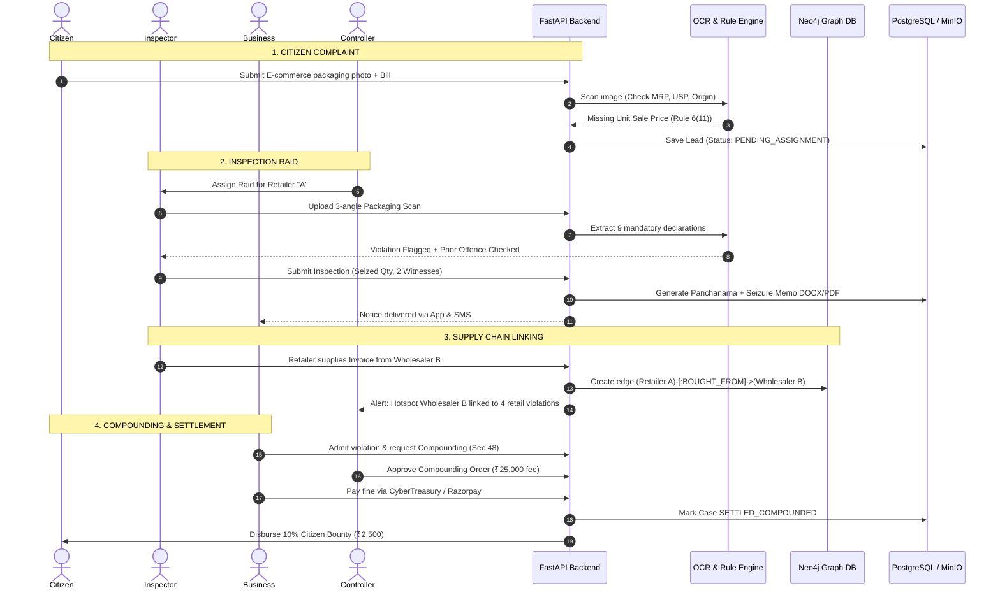

# 🏛️ End-to-End Technical Architecture & System Flow
## SIH PS 34: Legal Metrology Act, 2009 & Packaged Commodities Rules 2011 Automation

---

## 1. Executive Summary & Core Value Proposition

In India, packaging non-compliance accounts for extensive consumer deception, tax leakages, and unfair commercial practices. Small businesses and Self-Help Groups (SHGs) regularly violate statutory packaging mandates unwittingly due to the prohibitive cost (₹20,000–₹30,000) of Legal Metrology consultants. Meanwhile, on-ground Legal Metrology Inspectors suffer from manual error-prone inspections, lack of unified cross-jurisdiction repeat offender tracking, and cumbersome manual paperwork for statutory notices (Panchanama, Seizure Lists, Compounding Orders).

This system solves these challenges via an integrated **4-Persona Ecosystem** (Citizen, Business, Inspector, Controller) backed by:
1. **Computer Vision & Multilingual OCR (RapidOCR ONNX)** for multi-angle packaging audit.
2. **Statutory Legal Rule Engine** codifying Legal Metrology (Packaged Commodities) Rules 2011 (Rules 6–26), checking 9 mandatory declarations, exemptions, and calculating Section 48 compounding vs Section 49 court penalty schedules.
3. **Automated Statutory Notice Generator** producing court-admissible DOCX/PDF orders with PKCS#7 Digital Signatures.
4. **Supply Chain Traceability & Intelligence Graph** linking retailers backward to wholesalers, distributors, and manufacturers.
5. **Incentivized Citizen Crowdsourcing** offering reward bounties funded directly from compounded penalties.

---

## 2. Global Technical Architecture Diagram

```
┌──────────────────────────────────────────────────────────────────────────────────────────────────────────────────┐
│                                             1. USER & PRESENTATION LAYER                                         │
├──────────────────────────┬──────────────────────────┬────────────────────────────┬───────────────────────────────┤
│    CITIZEN / CONSUMER    │   BUSINESS / RETAILERS   │    INSPECTOR (ON-GROUND)   │     CENTRAL CONTROLLER        │
│     [Next.js 14 Web]     │  [Flutter App & Web]     │       [Flutter App]        │       [Next.js 14 Web]        │
│ • File E-commerce Lead   │ • Self-Compliance Check  │ • Multi-angle Packaging OCR│ • Statewide Heatmaps & BI     │
│ • Invoice & Pack Upload  │ • Pre-market Guidance    │ • 1st vs 2nd Offence Check │ • Cross-district Dispatch     │
│ • Case & Bounty Tracking │ • Respond to Notices     │ • 4-Stage Notice Generator │ • Approve Compounding Orders  │
│ • Metrology Awareness    │ • GRAS Penalty Payment   │ • Digital Panchanama & Wit │ • Supply-Chain Graph Query    │
└────────────┬─────────────┴────────────┬─────────────┴──────────────┬─────────────┴───────────────┬───────────────┘
             │                          │                            │                             │
═════════════╪══════════════════════════╪════════════════════════════╪═════════════════════════════╪═══════════════
             ▼                          ▼                            ▼                             ▼
┌──────────────────────────────────────────────────────────────────────────────────────────────────────────────────┐
│                                       2. API GATEWAY & SECURITY LAYER                                            │
├──────────────────────────────────────────────────────────────────────────────────────────────────────────────────┤
│  • Keycloak / JWT Authentication & Role-Based Access Control (RBAC)                                              │
│  • Reverse Proxy (CORS, Rate Limiting, Request Logging, Offline Sync Buffer)                                     │
│  • External Connectors: eMudhra Digital Signatures, Razorpay (GRAS 0435), WhatsApp / SMS Notification Gateway    │
└────────────────────────────────────────────────┬─────────────────────────────────────────────────────────────────┘
                                                 │
                                                 ▼
┌──────────────────────────────────────────────────────────────────────────────────────────────────────────────────┐
│                                        3. CORE BACKEND SERVICES (FastAPI)                                        │
├──────────────────────────┬──────────────────────────┬────────────────────────────┬───────────────────────────────┤
│   CASE & COMPLAINT SVC   │    INSPECTION SERVICE    │     NOTICE & LEGAL SVC     │     INTELLIGENCE & GRAPH      │
│ • Citizen lead intake    │ • Offline sync buffer    │ • Statutory Section Mapper │ • Repeat offender discovery   │
│ • Evidence validation    │ • Geo-tagging & route    │ • 4-stage Notice Engine    │ • Supply chain node link      │
│ • Bounty escrow queue    │ • Seizure record lock    │ • eMudhra Digital Signer   │ • Retailer ➔ Importer chain   │
└────────────┬─────────────┴────────────┬─────────────┴──────────────┬─────────────┴───────────────┬───────────────┘
             │                          │                            │                             │
             ▼                          ▼                            ▼                             ▼
┌──────────────────────────────────────────────────────────────────────────────────────────────────────────────────┐
│                                      4. AI & OCR COMPLIANCE ENGINE (Python)                                      │
├──────────────────────────────────────────────────────────────────────────────────────────────────────────────────┤
│  • Multi-Angle Packaging Image Processor (Deskew, CLAHE contrast boost, perspective transform, angle stitch)    │
│  • Multilingual RapidOCR ONNX Inference (Extracts 9 mandatory declarations under Rule 6)                         │
│  • Codified Rulebook & Exemption Engine (Rule 26 bulk exemptions, Schedule II weights, Sec 48 vs 49 compounding)│
└────────────────────────────────────────────────┬─────────────────────────────────────────────────────────────────┘
                                                 │
═════════════════════════════════════════════════╪═════════════════════════════════════════════════════════════════
                                                 ▼
┌──────────────────────────────────────────────────────────────────────────────────────────────────────────────────┐
│                                     5. DATA PERSISTENCE & STORAGE LAYER                                          │
├──────────────────────────┬──────────────────────────┬────────────────────────────┬───────────────────────────────┤
│   POSTGRESQL + POSTGIS   │       NEO4J GRAPH        │        MINIO / S3          │         RABBITMQ              │
│ • Users, Roles, Audits   │ • Supply-chain graph:    │ • Raw packaging photos     │ • Async OCR extraction jobs   │
│ • Inspections & Cases    │   (Mfr ➔ Dist ➔ Retail) │ • Eye-witness audio/video  │ • PDF rendering queue         │
│ • Legal Rules & Fines    │ • Counterfeit clusters   │ • Digitally signed PDFs    │ • WhatsApp / SMS alerts       │
└──────────────────────────┴──────────────────────────┴────────────────────────────┴───────────────────────────────┘
```

---

## 3. End-to-End Persona Workflows

### 3.1 Citizen / Consumer Flow (Crowdsourced Enforcement & Bounties)
1. **Evidence Upload:** The citizen notices an e-commerce or retail package violation (e.g., missing Unit Sale Price, dual MRP stickers, tampered manufacturing date).
2. **Intelligent Intake:** Through the Next.js portal, the citizen submits product images, invoice/bill copy, purchase link, and store GPS/location.
3. **Automated Verification:** The backend OCR engine immediately pre-screens the image to verify prima facie merit, eliminating bogus spam complaints.
4. **Ticket Routing:** Validated leads automatically show up on the Controller's heatmap and are dispatched to the nearest field inspector.
5. **Incentive Bounty:** Once the violation is confirmed, compounded, and paid by the offender, **10–20% of the penalty amount** is automatically credited to the citizen’s registered UPI/Bank account.

---

### 3.2 Business & Retailer Flow (Preventive Self-Compliance)
1. **Pre-Market Verification (Self-Check):** Small businesses and SHGs (e.g., Women SHGs manufacturing Achar/Papad/Spices) upload package mockups or label photos before spending money on mass printing.
2. **Instant Compliance Report:** The OCR and rule engine check:
   - Font height compliance based on package area.
   - Net weight standardization under Schedule II (e.g., 50g, 100g, 200g, 500g, 1kg).
   - Unit Sale Price format (`₹ X per g` or `₹ Y per 100g`).
   - Consumer care contact complete address and email/phone.
3. **Case Transparency Portal:** If an inspection occurs, the business dashboard displays all ongoing proceedings, uploaded seizure lists, inspection photos, and legal sections cited.
4. **Online Response & Payment:** Businesses can upload invoices, prove wholesaler source, apply for offence compounding online, and pay the compounding fee via CyberTreasury GRAS (Head 0435) / Razorpay without bureaucratic harassment.

---

### 3.3 Legal Metrology Inspector Flow (On-Ground Auditing & Field Tool)
1. **Inspection Initiation:** The inspector conducts a surprise raid or responds to a citizen lead.
2. **Multi-Angle Live Scan:** The inspector captures 2–3 photos (front branding, rear statutory panel, bottom batch/mfg stamp).
3. **Real-Time OCR & Rule Validation:** The engine extracts all 9 mandatory declarations in under 2 seconds and cross-references:
   - Schedule II standard sizes.
   - Rule 26 bulk exemptions (>25 kg or >25 L).
   - Central database check: Has this product or business had a prior conviction? (1st Offence vs 2nd Offence under Section 49).
4. **Automated Statutory Notice Workflow:**
   - **Stage 1 (Minor/Cure):** Improvement Notice issued with 7–15 day rectification window.
   - **Stage 2 (Major/Tampered):** Seizure List generated with batch number, quantity seized, and custody seal.
   - **Stage 3 (On-Site Memo):** Panchanama generated with 2 independent witness names, IDs, and statements.
   - **Stage 4 (Compounding):** Compounding order calculated under Section 48.
5. **Digital Signature:** Inspector digitally signs notices on-device via eMudhra PKCS#7 cryptographic certificate.

---

### 3.4 Central Controller Flow (Governance & Supply Chain Intelligence)
1. **Statewide Governance:** The Controller dashboard visualizes all district inspections, pending compounding orders, and revenue realization.
2. **Compounding Order Approval:** Compounding orders prepared by inspectors are reviewed and digitally stamped by the Controller.
3. **Cross-Jurisdiction Supply Chain Tracing:** When Retailer A in District 1 states they bought illegal packages from Distributor B in District 2, the Controller's Neo4j graph engine automatically triggers a cross-district inspection directive to the District 2 inspectorate.

---

## 4. Sequence Diagram: Full Enforcement & Resolution Lifecycle



---

## 5. Statutory 4-Stage Notice Progression Engine

```
                  ┌────────────────────────────────────────────────────────┐
                  │                 ON-SITE / ONLINE AUDIT                 │
                  │        (Multi-angle scan + Rule Engine flags)          │
                  └──────────────────────────┬─────────────────────────────┘
                                             │
                        Minor / Technical    │    Substantial / Counterfeit /
                        Label Defect         │    Weight Tampering
                                             ▼
                  ┌────────────────────────────────────────────────────────┐
                  │         STAGE 1: IMPROVEMENT NOTICE (Rule 24)          │
                  │ • Grants 7–15 days cure period                         │
                  │ • No seizure yet; retailer instructed to fix labelling │
                  └──────────────────────────┬─────────────────────────────┘
                                             │
                                   If Not Rectified
                                             │
                                             ▼
                  ┌────────────────────────────────────────────────────────┐
                  │            STAGE 2: SEIZURE LIST / BILL                │
                  │ • Inventory seized with batch, quantity, sample lots   │
                  │ • Evidence custody chain locked with geo-coordinates   │
                  └──────────────────────────┬─────────────────────────────┘
                                             │
                                             ▼
                  ┌────────────────────────────────────────────────────────┐
                  │         STAGE 3: PANCHANAMA (Sec 15 / CrPC 100)        │
                  │ • 2 independent witnesses details recorded             │
                  │ • Seizure memo + statement signed on-spot              │
                  └──────────────────────────┬─────────────────────────────┘
                                             │
                    ┌────────────────────────┴────────────────────────┐
                    │                                                 │
       If 1st Offence & Admits guilt                   If 2nd Offence OR Contested
                    ▼                                                 ▼
┌──────────────────────────────────────┐            ┌──────────────────────────────────┐
│   STAGE 4A: COMPOUNDING ORDER (S.48) │            │   STAGE 4B: COURT PROSECUTION    │
│ • Compounding Fee: ₹25,000–₹50,000   │            │   (Sec 49 / Court Complaint)     │
│ • Controller signs digitally         │            │ • Non-compoundable               │
│ • Business pays via CyberTreasury    │            │ • Jail up to 1 year + fine       │
└──────────────────────────────────────┘            └──────────────────────────────────┘
```

---

## 6. Detailed Data Schema & Models

### 6.1 Relational Schema (PostgreSQL)

All primary keys use UUIDv4 strings (`VARCHAR(36)`), managed consistently across client, API, and database layers. Foreign keys have explicit cascade behaviors, and all foreign key columns and frequently-queried filter columns are backed by B-tree indexes.

```sql
-- Users & Roles
CREATE TABLE users (
    id VARCHAR(36) PRIMARY KEY,
    name VARCHAR(255) NOT NULL,
    role VARCHAR(50) NOT NULL, -- CITIZEN, BUSINESS, INSPECTOR, CONTROLLER
    phone VARCHAR(20) UNIQUE NOT NULL,
    email VARCHAR(255) UNIQUE,
    district VARCHAR(100) DEFAULT 'Mumbai',
    created_at TIMESTAMP WITH TIME ZONE DEFAULT NOW()
);
CREATE INDEX ix_users_role ON users (role);
CREATE INDEX ix_users_created_at ON users (created_at);

-- Businesses & Retailers
CREATE TABLE businesses (
    id VARCHAR(36) PRIMARY KEY,
    gstin VARCHAR(15) UNIQUE,
    trade_name VARCHAR(255) NOT NULL,
    address TEXT NOT NULL,
    pincode VARCHAR(10) DEFAULT '400001',
    district VARCHAR(100) DEFAULT 'Mumbai',
    turnover_category VARCHAR(50) DEFAULT 'MICRO', -- MICRO, SMALL, MEDIUM, LARGE
    owner_user_id VARCHAR(36) REFERENCES users(id) ON DELETE SET NULL,
    created_at TIMESTAMP WITH TIME ZONE DEFAULT NOW()
);
CREATE INDEX ix_businesses_gstin ON businesses (gstin);
CREATE INDEX ix_businesses_trade_name ON businesses (trade_name);
CREATE INDEX ix_businesses_district ON businesses (district);
CREATE INDEX ix_businesses_owner_user_id ON businesses (owner_user_id);
CREATE INDEX ix_businesses_created_at ON businesses (created_at);

-- Inspections
CREATE TABLE inspections (
    id VARCHAR(36) PRIMARY KEY,
    inspector_id VARCHAR(36) NOT NULL REFERENCES users(id) ON DELETE RESTRICT,
    business_id VARCHAR(36) REFERENCES businesses(id) ON DELETE SET NULL,
    business_name VARCHAR(255), -- Denormalized for low-latency list queries
    latitude DOUBLE PRECISION,
    longitude DOUBLE PRECISION,
    inspection_type VARCHAR(50) DEFAULT 'routine', -- routine, complaintBased, supplyChainLinked
    status VARCHAR(50) DEFAULT 'assigned', -- assigned, inProgress, underReview, violationsConfirmed, noticeIssued, completed
    created_at TIMESTAMP WITH TIME ZONE DEFAULT NOW()
);
CREATE INDEX ix_inspections_inspector_id ON inspections (inspector_id);
CREATE INDEX ix_inspections_business_id ON inspections (business_id);
CREATE INDEX ix_inspections_status ON inspections (status);
CREATE INDEX ix_inspections_inspection_type ON inspections (inspection_type);
CREATE INDEX ix_inspections_created_at ON inspections (created_at);

-- Extracted Product Packages
CREATE TABLE inspection_products (
    id VARCHAR(36) PRIMARY KEY,
    inspection_id VARCHAR(36) NOT NULL REFERENCES inspections(id) ON DELETE CASCADE,
    commodity_name VARCHAR(255),
    category VARCHAR(100) DEFAULT 'GENERAL',
    brand_name VARCHAR(255),
    declared_mrp VARCHAR(100), -- Stored as extracted string to preserve currency symbols/units
    declared_net_qty VARCHAR(100),
    declared_usp VARCHAR(100),
    mfg_date VARCHAR(100),
    expiry_date VARCHAR(100),
    size VARCHAR(100),
    country_of_origin VARCHAR(100) DEFAULT 'India',
    raw_ocr_text TEXT,
    created_at TIMESTAMP WITH TIME ZONE DEFAULT NOW()
);
CREATE INDEX ix_inspection_products_inspection_id ON inspection_products (inspection_id);
CREATE INDEX ix_inspection_products_created_at ON inspection_products (created_at);

-- Statutory Violations Flagged
CREATE TABLE violations (
    id VARCHAR(36) PRIMARY KEY,
    inspection_product_id VARCHAR(36) NOT NULL REFERENCES inspection_products(id) ON DELETE CASCADE,
    rule_id VARCHAR(50) NOT NULL, -- e.g. LM-PC-016
    title VARCHAR(255) NOT NULL,
    description TEXT,
    legal_section VARCHAR(100) NOT NULL, -- Section 36(1)
    severity VARCHAR(50) DEFAULT 'medium', -- low, medium, high, critical
    is_second_offence BOOLEAN DEFAULT FALSE,
    created_at TIMESTAMP WITH TIME ZONE DEFAULT NOW()
);
CREATE INDEX ix_violations_inspection_product_id ON violations (inspection_product_id);
CREATE INDEX ix_violations_rule_id ON violations (rule_id);
CREATE INDEX ix_violations_severity ON violations (severity);
CREATE INDEX ix_violations_created_at ON violations (created_at);

-- Statutory Notices & Orders
CREATE TABLE notices (
    id VARCHAR(36) PRIMARY KEY,
    inspection_id VARCHAR(36) NOT NULL REFERENCES inspections(id) ON DELETE CASCADE,
    notice_type VARCHAR(50) NOT NULL, -- improvement, seizure, compounding, panchanama
    stage INTEGER DEFAULT 1, -- 1: Improvement, 2: Seizure, 3: Panchanama, 4: Compounding, 5: Closed
    document_path VARCHAR(500) NOT NULL,
    digital_signature_hash TEXT,
    compounding_fee DOUBLE PRECISION DEFAULT 25000.0,
    payment_status VARCHAR(50) DEFAULT 'UNPAID', -- UNPAID, PAID, EXEMPTED, complianceSubmitted, underDispute, consentGiven
    issued_at TIMESTAMP WITH TIME ZONE DEFAULT NOW()
);
CREATE INDEX ix_notices_inspection_id ON notices (inspection_id);
CREATE INDEX ix_notices_notice_type ON notices (notice_type);
CREATE INDEX ix_notices_payment_status ON notices (payment_status);
CREATE INDEX ix_notices_issued_at ON notices (issued_at);

-- Citizen Complaints & Bounties
CREATE TABLE complaints (
    id VARCHAR(36) PRIMARY KEY,
    citizen_id VARCHAR(36) REFERENCES users(id) ON DELETE SET NULL,
    citizen_name VARCHAR(255) DEFAULT 'Aware Citizen',
    citizen_phone VARCHAR(20) DEFAULT '9876543210',
    store_name VARCHAR(255) NOT NULL,
    store_address TEXT,
    product_name VARCHAR(255) NOT NULL,
    evidence_url VARCHAR(500),
    invoice_url VARCHAR(500),
    status VARCHAR(50) DEFAULT 'SUBMITTED', -- SUBMITTED, VERIFIED, RAIDED, COMPOUNDED, REJECTED
    bounty_amount DOUBLE PRECISION DEFAULT 0.0,
    created_at TIMESTAMP WITH TIME ZONE DEFAULT NOW()
);
CREATE INDEX ix_complaints_citizen_id ON complaints (citizen_id);
CREATE INDEX ix_complaints_status ON complaints (status);
CREATE INDEX ix_complaints_created_at ON complaints (created_at);
```

### 6.2 Virtual Projections & Client Contracts

Rather than duplicating relational rows, key lifecycle views are projected dynamically by the API layer:
1. **`LegalCase`**: Projected dynamically from `InspectionModel` joined with its associated `notices` and `violations`. Encapsulates the complete visual timeline and current state (`inspectionDue`, `inProgress`, `underReview`, `noticeIssued`, `awaitingBusinessResponse`, `compounding`, `closed`).
2. **`PaymentRecord`**: Manages compounding fee payments via Razorpay integration, updating `notices.payment_status` (`PAID`) and closing the case (`inspections.status = 'completed'`).
3. **`OffenceHistory`**: Computed dynamically across historical inspections and violations matching the inspected commodity or business GSTIN, categorizing risk into `none`, `first`, `second`, or `repeat`.
4. **Enum Casing Contract**: The API serializes enums in exact camelCase matching the Flutter client models (`inProgress`, `violationsConfirmed`, `noticeIssued`, `completed`, `accepted`, `potential`).

---

## 7. Implementation Roadmap & Milestones

| Phase | Component | Description | Current Status |
| :--- | :--- | :--- | :--- |
| **Phase 1** | **Knowledgebase & Legal Rules** | Codified rules LM-PC-006 to LM-PC-029, Schedule II, Rule 26 bulk exemptions | ✅ Complete |
| **Phase 2** | **AI OCR & Compliance Engine** | RapidOCR ONNX multi-angle extraction + automated section validator | ✅ Complete |
| **Phase 3** | **Automated Notice Generator** | DOCX/PDF generation matching statutory templates for Panchanama/Compounding | ✅ Complete |
| **Phase 4** | **Mobile App & Web Dashboards** | Flutter mobile app for inspector/business + Next.js web portal with overflow fixes | ✅ Complete |
| **Phase 5** | **Relational Persistence** | PostgreSQL schema with full index coverage, explicit FK cascades, and Alembic migrations | ✅ Complete |
| **Phase 6** | **Supply Chain Traceability** | Neo4j graph queries to link retailer violations backward to source distributors | 🔄 Next Step |
| **Phase 7** | **Digital Signature & Payment** | Live eMudhra PKCS#7 seal + Razorpay / CyberTreasury GRAS payment webhook | 🔄 Next Step |
| **Phase 8** | **Citizen Bounty Disbursement** | Auto-calculate and disburse 10% bounty upon compounding resolution | 🔄 Next Step |

---

## 8. Hackathon Presentation & Demonstration Script

To win SIH PS 34, demonstrate the project through 4 interconnected acts:

1. **Act 1: The Citizen Lead**
   - Open Web Portal. Show a consumer uploading an e-commerce pasta box photo that is missing Unit Sale Price. The system auto-validates the lead in 2 seconds.
2. **Act 2: The Inspector Raid**
   - Open Flutter App. Show the alert arriving on the inspector's dashboard. Inspector captures packaging photos. The OCR extracts declarations, flags Rule 6(11), and generates an authentic, legally formatted Panchanama with 2 witnesses.
3. **Act 3: Supply Chain Network**
   - Inspector enters that the retailer bought the item from "Distributor X". Central Controller dashboard reveals a graph linking Distributor X to 12 retail violations across 3 districts.
4. **Act 4: Preventive SHG Check & Settlement**
   - Switch to Business login. Show a small Self-Help Group uploading an Achar label and receiving an instant pre-market compliance certificate. Then show the offender paying the compounding fee online and the citizen receiving their reward.
